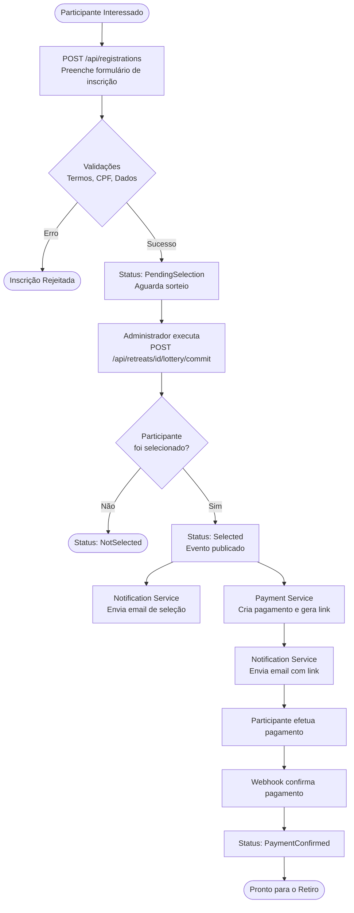
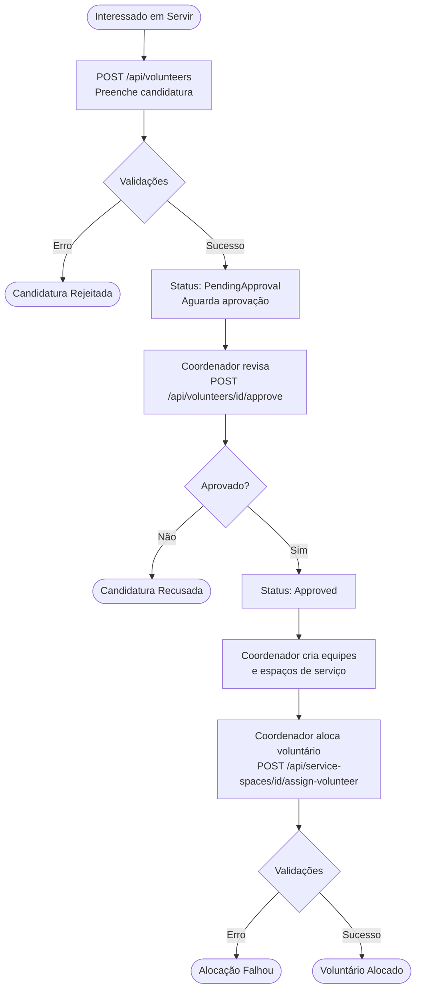
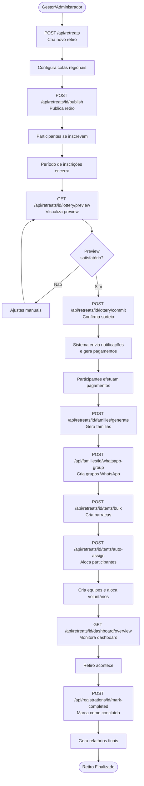
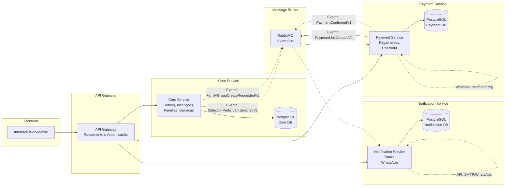

# FUNCIONALIDADES IMPLEMENTADAS

## Gestão de Retiros

A gestão de retiros constitui a funcionalidade central do sistema SAMGestor, permitindo que administradores criem, configurem e gerenciem eventos espirituais de forma completa. Esta seção descreve como o sistema resolve a necessidade de centralizar todas as informações e operações relacionadas a um retiro espiritual.

### Criação e Configuração de Retiros

O administrador inicia a gestão de um novo retiro através do endpoint principal de criação:

**Endpoint:** `POST /api/retreats`

O sistema aplica as seguintes regras de negócio durante a criação:
- **RN1:** A data de início deve ser posterior à data de término das inscrições
- **RN2:** A capacidade máxima deve ser maior que zero e múltipla de 4 (para formação de famílias)
- **RN3:** O período de inscrições deve anteceder o início do retiro em pelo menos 7 dias
- **RN4:** O nome do retiro deve ser único no sistema

### Configuração de Cotas Regionais

Para garantir diversidade geográfica, o sistema permite configurar cotas regionais através do endpoint:

**Endpoint:** `POST /api/retreats/{id}/region-configs`

Esta configuração é fundamental para o algoritmo de contemplação (Seção 7.4), garantindo que 50% das vagas sejam destinadas a participantes da região Oeste e 50% para outras regiões.

###  Operações de Gestão

O sistema oferece endpoints completos para gerenciamento do ciclo de vida do retiro:

- **GET /api/retreats:** Lista todos os retiros com filtros (status, data, categoria)
- **GET /api/retreats/{id}:** Obtém detalhes completos de um retiro específico
- **PUT /api/retreats/{id}:** Atualiza informações do retiro (apenas se status = Draft)
- **DELETE /api/retreats/{id}:** Remove retiro (apenas se não houver inscrições)
- **POST /api/retreats/{id}/publish:** Publica retiro e abre inscrições públicas
- **POST /api/retreats/{id}/cancel:** Cancela retiro e notifica todos os inscritos

###  Validações Implementadas

O sistema implementa validações automáticas que protegem a integridade dos dados:

- **Validação de Datas:** Impede criação de retiros com datas inconsistentes
- **Validação de Capacidade:** Alerta quando inscrições ultrapassam 90% da capacidade
- **Validação de Status:** Bloqueia edições em retiros já publicados ou finalizados
- **Validação de Janela de Inscrição:** Impede inscrições fora do período configurado (RN9)

## Fluxo de Participação (Fazer o Retiro)

O fluxo de participação representa a jornada completa de um participante desde a inscrição inicial até a confirmação final de sua presença no retiro. Esta seção descreve cada etapa do processo end-to-end, demonstrando como o sistema orquestra múltiplos microserviços para proporcionar uma experiência fluida e automatizada.

### Inscrição Pública

O processo inicia quando um interessado acessa o formulário público de inscrição. O sistema captura informações essenciais através do endpoint:

**Endpoint:** `POST /api/registrations`

O sistema aplica as seguintes validações durante a inscrição:

- **RN5:** Termos de uso devem ser aceitos (termsAccepted = true)
- **RN8:** CPF deve ser único por retiro (não permite inscrições duplicadas)
- **RN9:** Inscrição só é aceita dentro da janela configurada
- **RN11:** CPF não pode estar na lista de bloqueados
- **RN12:** Participante deve ter idade mínima de 16 anos

Após a validação bem-sucedida, o sistema publica o evento `RegistrationCreatedV1` para notificar outros serviços.

### Upload de Foto 3x4

Complementando a inscrição, o participante deve enviar uma foto 3x4 que será utilizada no crachá:

**Endpoint:** `POST /api/registrations/{id}/photo`

**Request:** Multipart/form-data com arquivo de imagem

O sistema valida:
- Formato aceito: JPG, PNG
- Tamanho máximo: 2MB
- Proporção recomendada: 3:4

A foto é armazenada no serviço de Storage e o link é vinculado à inscrição.

### Contemplação no Sorteio

Após o encerramento das inscrições, o administrador executa o sorteio de contemplação:

**Endpoint:** `POST /api/retreats/{id}/lottery/commit`

O algoritmo de sorteio (detalhado na Seção 7.4) seleciona participantes respeitando as cotas configuradas. Para cada participante selecionado:

1. Status da inscrição muda de `PendingSelection` para `Selected`
2. Sistema publica evento `SelectionParticipantSelectedV1`
3. Data de seleção é registrada

### Notificação de Seleção

O serviço **Notification** consome o evento `SelectionParticipantSelectedV1` e envia automaticamente um email ao participante selecionado:

**Conteúdo do Email:**
- Parabéns pela seleção
- Informações detalhadas do retiro (datas, local, horários)
- Próximos passos: aguardar link de pagamento
- Prazo para confirmação de pagamento

### Geração de Pagamento

Simultaneamente, o serviço **Payment** também consome o evento `SelectionParticipantSelectedV1` e executa as seguintes ações:

**Endpoint Interno:** `POST /api/payments/create-from-selection`

1. Cria registro de pagamento no banco de dados
2. Gera link de checkout (fake em desenvolvimento, MercadoPago em produção)
3. Define prazo de vencimento (7 dias após seleção)
4. Publica evento `PaymentLinkCreatedV1`

### Envio de Link de Pagamento

O serviço **Notification** consome o evento `PaymentLinkCreatedV1` e envia um segundo email ao participante:

**Conteúdo do Email:**
- Link direto para checkout
- Valor a pagar (R$ 150,00)
- Prazo de vencimento
- Instruções de pagamento
- Alerta: vaga será liberada se não pagar no prazo

### Confirmação de Pagamento

Quando o participante efetua o pagamento através do gateway (MercadoPago ou simulador fake):

**Endpoint Webhook:** `POST /api/payments/webhook`

O serviço Payment processa o webhook e:

1. Valida autenticidade da notificação
2. Atualiza status do pagamento para `Confirmed`
3. Publica evento `PaymentConfirmedV1`

### Atualização de Status e Confirmação Final

O serviço **Core** consome o evento `PaymentConfirmedV1` e:

1. Atualiza status da inscrição de `Selected` para `PaymentConfirmed`
2. Registra data de confirmação
3. Incrementa contador de participantes confirmados do retiro

O serviço **Notification** também consome o evento e envia email final de confirmação:

**Conteúdo do Email:**
- Confirmação de pagamento recebido
- Instruções finais para o retiro
- O que levar (roupas, itens pessoais)
- Informações de transporte e chegada
- Contatos para dúvidas

### Resumo do Fluxo de Participação

O fluxo completo demonstra a orquestração entre três microserviços (Core, Payment, Notification) através de eventos assíncronos, proporcionando uma experiência automatizada e consistente. As regras de negócio RN5, RN8, RN9, RN11 e RN12 são aplicadas durante a inscrição, garantindo a integridade dos dados desde o início do processo.

## Fluxo de Voluntariado (Servir no Retiro)

O fluxo de voluntariado permite que pessoas interessadas em servir durante o retiro se candidatem a posições específicas em equipes de trabalho. Esta seção descreve como o sistema gerencia desde a candidatura até a alocação final em espaços de serviço.

### Candidatura para Voluntariado

O interessado em servir inicia o processo através do endpoint de candidatura:

**Endpoint:** `POST /api/volunteers`

O sistema aplica validações:

- **RN13:** CPF deve ser único por retiro (não pode ser voluntário e participante simultaneamente)
- **RN14:** Voluntário deve ter idade mínima de 18 anos
- **RN15:** Janela de candidatura deve estar aberta

### Aprovação de Voluntários

O coordenador revisa as candidaturas e aprova através do endpoint:

**Endpoint:** `POST /api/volunteers/{id}/approve`

O status muda de `PendingApproval` para `Approved`, e o sistema publica evento `VolunteerApprovedV1`.

### Criação de Equipes e Espaços de Serviço

O administrador cria equipes de trabalho e seus respectivos espaços:

**Endpoint:** `POST /api/retreats/{id}/teams`

**Endpoint:** `POST /api/teams/{id}/service-spaces`

### Alocação de Voluntários em Espaços

O coordenador aloca voluntários aprovados em espaços de serviço:

**Endpoint:** `POST /api/service-spaces/{id}/assign-volunteer`

O sistema valida:

- **RN16:** Espaço não pode exceder capacidade máxima
- **RN17:** Voluntário não pode estar alocado em múltiplos espaços no mesmo turno
- **RN18:** Voluntário deve estar com status `Approved`

### Notificações aos Voluntários

Após alocação, o sistema publica evento `VolunteerAssignedV1` e o serviço Notification envia email:

**Conteúdo do Email:**
- Confirmação de alocação
- Equipe e espaço de serviço designados
- Horários de trabalho
- Instruções específicas da equipe
- Contato do coordenador

### Gestão de Escalas

O sistema permite visualizar escalas completas:

**Endpoint:** `GET /api/retreats/{id}/schedules`

## Contemplação (Sorteio com Cotas)

O algoritmo de contemplação é uma das funcionalidades mais críticas do sistema, garantindo um processo de seleção justo e transparente que respeita cotas regionais e de gênero. Esta seção detalha como o sistema implementa o sorteio com preview e confirmação.

### Objetivo do Sorteio

O sorteio visa selecionar participantes de forma aleatória, mas respeitando critérios de diversidade:

- **Diversidade Regional:** 50% das vagas para região Oeste, 50% para outras regiões
- **Equilíbrio de Gênero:** 50% masculino, 50% feminino
- **Transparência:** Permitir preview antes de confirmar definitivamente
- **Flexibilidade:** Possibilitar ajustes manuais após sorteio automático

### Configuração de Cotas

Antes de executar o sorteio, o administrador deve configurar as cotas regionais:

**Endpoint:** `POST /api/retreats/{id}/region-configs`

Esta configuração é armazenada e utilizada pelo algoritmo de sorteio. O sistema valida que a soma dos percentuais seja exatamente 100%.

### Algoritmo de Sorteio

O algoritmo implementado segue os seguintes passos:

**Passo 1: Separação por Região**
- Busca todas as inscrições com status `PendingSelection`
- Separa em dois grupos: Região Oeste vs Outras Regiões
- Utiliza a lista de cidades configurada para classificação

**Passo 2: Separação por Gênero**
- Dentro de cada grupo regional, separa por gênero (Male/Female)
- Resulta em 4 grupos: Oeste-Masculino, Oeste-Feminino, Outras-Masculino, Outras-Feminino

**Passo 3: Cálculo de Vagas por Grupo**
- Total de vagas: 120 (exemplo)
- Vagas Oeste: 60 (50%)
- Vagas Outras: 60 (50%)
- Vagas Oeste-Masculino: 30 (25% do total)
- Vagas Oeste-Feminino: 30 (25% do total)
- Vagas Outras-Masculino: 30 (25% do total)
- Vagas Outras-Feminino: 30 (25% do total)

**Passo 4: Sorteio Aleatório**
- Para cada grupo, embaralha aleatoriamente as inscrições
- Seleciona as primeiras N inscrições (onde N = vagas calculadas)
- Utiliza algoritmo Fisher-Yates para embaralhamento justo

**Passo 5: Validação de Cotas**
- Verifica se as cotas foram atingidas
- Gera alertas se houver inscrições insuficientes em algum grupo
- Permite ajustes manuais se necessário

### Preview do Sorteio

Antes de confirmar, o administrador pode visualizar o resultado do sorteio:

**Endpoint:** `GET /api/retreats/{id}/lottery/preview`

O preview **NÃO persiste** as seleções no banco de dados, permitindo múltiplas execuções até o resultado desejado.

### Alertas do Preview

O sistema gera alertas quando detecta problemas

###  Confirmação do Sorteio (Commit)

Após revisar o preview e fazer ajustes manuais se necessário, o administrador confirma o sorteio:

**Endpoint:** `POST /api/retreats/{id}/lottery/commit`

O commit executa as seguintes ações em uma **transação ACID** com isolamento serializável:

1. Atualiza status de todas as inscrições selecionadas para `Selected`
2. Registra data/hora da seleção
3. Publica evento `SelectionParticipantSelectedV1` para cada selecionado
4. Marca o sorteio como confirmado (impede nova execução)

A transação garante que ou todas as seleções são persistidas, ou nenhuma é (atomicidade).

### Seleção e Deseleção Manual

O sistema permite ajustes manuais após o sorteio automático:

**Endpoint:** `POST /api/retreats/{id}/lottery/select/{registrationId}`

Seleciona manualmente um participante específico. O sistema valida:
- **RN24:** Não pode exceder o número máximo de vagas do retiro
- **RN6:** Participante deve estar com status `PendingSelection` ou `NotSelected`
- **RN7:** Retiro não pode estar finalizado

**Endpoint:** `POST /api/retreats/{id}/lottery/unselect/{registrationId}`

Remove seleção de um participante. O sistema valida:
- Participante deve estar com status `Selected`
- Sorteio não pode estar confirmado (committed)

Esses endpoints são úteis para casos especiais, como:
- Substituir participante que desistiu
- Corrigir erro no sorteio automático
- Adicionar participante por critério especial (ex: membro da organização)

## Gestão de Famílias

A gestão de famílias espirituais é uma funcionalidade essencial do sistema SAMGestor, permitindo a formação de grupos de acolhimento compostos por quatro participantes. Esta seção descreve como o sistema automatiza a criação de famílias respeitando critérios de diversidade e validações de negócio.

### Conceito de Família Espiritual

Uma família espiritual no contexto do retiro SAM é composta por:

- **Composição:** Exatamente 4 participantes (2 homens/padrinhos + 2 mulheres/madrinhas)
- **Critérios de Formação:** Idades próximas (diferença máxima recomendada de 10 anos), cidades diferentes (para promover diversidade), sobrenomes diferentes (para evitar parentesco)
- **Objetivo:** Proporcionar acolhimento, suporte emocional e espiritual durante o retiro

### Geração Automática de Famílias

O sistema oferece um algoritmo inteligente para geração automática de famílias:

**Endpoint:** `POST /api/retreats/{id}/families/generate`

**Algoritmo de Geração:**

**Passo 1: Filtragem de Participantes**
- Busca todos os participantes com status `PaymentConfirmed`
- Exclui participantes já alocados em famílias
- Separa por gênero (Masculino e Feminino)

**Passo 2: Agrupamento por Faixa Etária**
- Calcula idade de cada participante
- Agrupa em faixas: 16-20, 21-25, 26-30, 31-35, 36-40, 41+
- Prioriza combinações dentro da mesma faixa ou faixas adjacentes

**Passo 3: Formação de Combinações**
- Para cada faixa etária, tenta formar famílias com 2M + 2F
- Valida sobrenomes diferentes (RN17 - bloqueante)
- Verifica cidades diferentes (RN10 - alerta, mas permite)
- Calcula diferença de idade entre membros (RN11 - alerta se > 10 anos)

**Passo 4: Validação e Criação**
- Valida cada família formada
- Cria registros no banco de dados
- Retorna estatísticas e alertas

### Validações e Alertas

O sistema implementa validações rigorosas durante a formação de famílias

### Criação Manual de Famílias

Além da geração automática, o sistema permite criação manual:

**Endpoint:** `POST /api/retreats/{id}/families`

O sistema valida todas as regras (RN8, RN16, RN17) e retorna erros ou alertas conforme necessário.

### Criação de Grupos WhatsApp

Para facilitar a comunicação entre membros da família, o sistema oferece integração com WhatsApp:

**Endpoint:** `POST /api/families/{id}/whatsapp-group`

O sistema publica evento `FamilyGroupCreateRequestedV1`

O serviço **Notification** consome o evento e:
1. Cria grupo no WhatsApp (via API Business)
2. Adiciona todos os membros
3. Envia mensagem de boas-vindas
4. Retorna link do grupo

### Operações CRUD de Famílias

O sistema oferece endpoints completos para gestão:

**Listar Famílias:**
**Endpoint:** `GET /api/retreats/{id}/families?page=1&pageSize=20&hasWarnings=true`

**Atualizar Família:**
**Endpoint:** `PUT /api/retreats/{id}/families/{familyId}`

**Remover Família:**
**Endpoint:** `DELETE /api/retreats/{id}/families/{familyId}`

Validação: Só permite remoção se retiro não estiver finalizado.

## Gestão de Barracas

A gestão de barracas é fundamental para organizar a acomodação física dos participantes durante o retiro. O sistema oferece funcionalidades completas para criação, alocação e monitoramento de ocupação das barracas.

### Conceito de Barraca

As barracas no sistema SAMGestor representam:

- **Acomodações Físicas:** Espaços onde participantes dormem durante o retiro
- **Segregação por Gênero:** Barracas exclusivamente Masculinas ou Femininas
- **Capacidade Configurável:** Cada barraca tem capacidade máxima (ex: 4, 6, 8 pessoas)
- **Identificação:** Número ou nome único para facilitar localização

### Criação de Barracas

O administrador cria barracas individualmente ou em lote:

**Endpoint:** `POST /api/retreats/{id}/tents`

**Endpoint:** `POST /api/retreats/{id}/tents/bulk`

Este endpoint cria 15 barracas automaticamente: BM01, BM02, ..., BM15.

### Alocação Automática de Participantes

O sistema oferece algoritmo inteligente para alocar participantes em barracas:

**Endpoint:** `POST /api/retreats/{id}/tents/auto-assign`

**Algoritmo de Alocação:**

**Passo 1: Filtragem**
- Busca participantes com status `PaymentConfirmed`
- Exclui participantes já alocados em barracas
- Separa por gênero (Male/Female)

**Passo 2: Ordenação de Barracas**
- Lista barracas da categoria correspondente
- Ordena por ocupação atual (menor para maior)
- Prioriza barracas com menor ocupação

**Passo 3: Alocação**
- Para cada participante, busca primeira barraca com vaga disponível
- Valida capacidade máxima (RN23)
- Valida compatibilidade de gênero (RN15)
- Cria vínculo participante → barraca

### Alocação Manual

Além da alocação automática, o sistema permite alocação manual:

**Endpoint:** `POST /api/tents/{id}/assign-participant`

O sistema valida:
- **RN15:** Gênero do participante deve ser compatível com categoria da barraca
- **RN23:** Barraca não pode exceder capacidade máxima
- **RN16:** Participante não pode estar alocado em múltiplas barracas

### Alertas de Ocupação

O sistema gera alertas automáticos sobre o estado das barracas

### Operações de Gestão

**Listar Barracas com Ocupação:**
**Endpoint:** `GET /api/retreats/{id}/tents?category=Male&includeOccupancy=true`

**Remover Participante da Barraca:**
**Endpoint:** `DELETE /api/tents/{tentId}/participants/{participantId}`

**Estatísticas de Barracas:**
**Endpoint:** `GET /api/retreats/{id}/tents/statistics`

## Gestão de Equipes e Espaços

A gestão de equipes e espaços de serviço permite organizar os voluntários em grupos de trabalho específicos, garantindo que todas as atividades do retiro sejam cobertas adequadamente.

### Criação de Equipes

**Endpoint:** `POST /api/retreats/{id}/teams`

### Criação de Espaços de Serviço

Cada equipe pode ter múltiplos espaços de serviço:

**Endpoint:** `POST /api/teams/{id}/service-spaces`

### Estatísticas de Equipes

**Endpoint:** `GET /api/retreats/{id}/teams/statistics`

## Dashboards e Relatórios

Os dashboards e relatórios fornecem visões consolidadas e analíticas dos dados do retiro, permitindo que gestores tomem decisões informadas e acompanhem o progresso em tempo real.

###  Relatórios em PDF

O sistema utiliza a biblioteca **QuestPDF** para gerar relatórios profissionais em formato PDF:

**Endpoint:** `GET /api/retreats/{id}/reports/participants?format=pdf`

**Conteúdo do Relatório:**
- Cabeçalho com logo e informações do retiro
- Lista completa de participantes ordenada por família
- Informações: Nome, CPF, Cidade, Família, Barraca, Equipe
- Rodapé com data de geração e paginação

**Outros Relatórios Disponíveis:**

**Relatório de Famílias:**
**Endpoint:** `GET /api/retreats/{id}/reports/families?format=pdf`

Conteúdo:
- Lista de todas as famílias
- Membros de cada família com foto 3x4
- Informações de contato
- Alertas e observações

**Relatório de Barracas:**
**Endpoint:** `GET /api/retreats/{id}/reports/tents?format=pdf`

Conteúdo:
- Mapa de barracas com ocupação
- Lista de participantes por barraca
- Taxa de ocupação
- Alertas de capacidade

**Relatório de Equipes:**
**Endpoint:** `GET /api/retreats/{id}/reports/teams?format=pdf`

## Gestão de Retiros

Funcionalidade central que permite criar, configurar e gerenciar eventos espirituais de forma completa, centralizando todas as informações e operações relacionadas a um retiro.

**Endpoints principais:**
- `POST /api/retreats` - Criar novo retiro
- `GET /api/retreats` - Listar retiros com filtros
- `GET /api/retreats/{id}` - Detalhes de um retiro
- `PUT /api/retreats/{id}` - Atualizar retiro (apenas em status Draft)
- `DELETE /api/retreats/{id}` - Remover retiro (sem inscrições)
- `POST /api/retreats/{id}/publish` - Publicar e abrir inscrições
- `POST /api/retreats/{id}/cancel` - Cancelar retiro

**Validações principais:**
- Datas consistentes e períodos válidos
- Capacidade máxima respeitada
- Bloqueio de edições em retiros publicados/finalizados
- Janela de inscrição configurável

## Fluxo de Participação

Jornada completa de um participante desde a inscrição inicial até a confirmação final de sua presença no retiro, orquestrando múltiplos microserviços para proporcionar uma experiência fluida e automatizada.

**Endpoints principais:**
- `POST /api/registrations` - Inscrição pública
- `POST /api/registrations/{id}/photo` - Upload de foto 3x4
- `POST /api/retreats/{id}/lottery/commit` - Executar sorteio
- `POST /api/retreats/{id}/lottery/select/{registrationId}` - Seleção manual
- `POST /api/payments/webhook` - Webhook de confirmação de pagamento
- `POST /api/registrations/{id}/mark-completed` - Marcar como concluído

**Fluxo:**
1. Participante se inscreve com validações de termos, CPF e dados pessoais
2. Sorteio automático respeitando cotas regionais e preferências
3. Notificação de seleção via email
4. Geração de link de pagamento (MercadoPago)
5. Confirmação de pagamento via webhook
6. Marcação como concluído após o retiro

## Fluxo de Voluntariado

Permite que pessoas interessadas em servir durante o retiro se candidatem a posições específicas em equipes de trabalho.

**Endpoints principais:**
- `POST /api/volunteers` - Candidatura para voluntariado
- `POST /api/volunteers/{id}/approve` - Aprovação de voluntário
- `POST /api/retreats/{id}/teams` - Criar equipes
- `POST /api/teams/{id}/service-spaces` - Criar espaços de serviço
- `POST /api/service-spaces/{id}/assign-volunteer` - Alocar voluntário

**Fluxo:**
1. Candidato se inscreve como voluntário
2. Coordenador revisa e aprova candidatura
3. Criação de equipes e espaços de serviço
4. Alocação de voluntários em espaços com validações de compatibilidade

## Gestão de Famílias

Funcionalidade essencial que automatiza a formação de grupos de acolhimento compostos por participantes com critérios de diversidade.

**Endpoints principais:**
- `POST /api/retreats/{id}/families/generate` - Geração automática
- `GET /api/retreats/{id}/families` - Listar famílias
- `PUT /api/retreats/{id}/families/{id}` - Ajustar manualmente
- `POST /api/families/{id}/whatsapp-group` - Criar grupo WhatsApp

**Critérios de formação:**
- Composição: 2 homens + 2 mulheres (mínimo)
- Idades próximas (diferença máxima de 10 anos)
- Cidades diferentes (promover diversidade)
- Sobrenomes diferentes (evitar parentesco)

## Gestão de Barracas

Organiza a acomodação física dos participantes durante o retiro com funcionalidades de criação, alocação e monitoramento.

**Endpoints principais:**
- `POST /api/retreats/{id}/tents/bulk` - Criar barracas em lote
- `POST /api/retreats/{id}/tents/auto-assign` - Alocar participantes automaticamente
- `GET /api/retreats/{id}/tents` - Listar barracas
- `PUT /api/retreats/{id}/tents/{id}` - Atualizar barraca

**Validações:**
- Segregação por gênero
- Capacidade máxima respeitada
- Alertas de ocupação (subutilizadas ou acima da capacidade)

## Sorteio e Seleção

Sistema inteligente de sorteio que respeita cotas regionais e critérios de diversidade.

**Endpoints principais:**
- `GET /api/retreats/{id}/lottery/preview` - Visualizar preview
- `POST /api/retreats/{id}/lottery/commit` - Confirmar sorteio
- `POST /api/retreats/{id}/lottery/select/{registrationId}` - Seleção manual
- `POST /api/retreats/{id}/lottery/deselect/{registrationId}` - Deseleção manual

**Características:**
- Respeita cotas regionais configuradas
- Considera preferências de idade e cidade
- Transação atômica (tudo ou nada)
- Permite ajustes manuais após execução

## Dashboards e Relatórios

Fornece visões consolidadas e analíticas para acompanhamento em tempo real.

**Endpoints principais:**
- `GET /api/retreats/{id}/dashboard/overview` - Dashboard geral
- `GET /api/retreats/{id}/dashboard/payments` - Dashboard de pagamentos
- `GET /api/retreats/{id}/reports/participants?format=pdf` - Relatório de participantes
- `GET /api/retreats/{id}/reports/tents?format=pdf` - Relatório de barracas
- `GET /api/retreats/{id}/reports/teams?format=pdf` - Relatório de equipes
- `GET /api/retreats/{id}/export?format=excel` - Exportar dados

**Formatos suportados:**
- Excel (.xlsx) - Múltiplas planilhas
- CSV - Dados tabulares
- JSON - Integração com outros sistemas
- PDF - Documentos profissionais

## Funcionalidades Administrativas

Gestão de usuários, permissões, autenticação e configurações globais.

**Endpoints principais:**
- `POST /api/users` - Criar usuário
- `GET /api/users` - Listar usuários
- `PUT /api/users/{id}` - Atualizar usuário
- `DELETE /api/users/{id}` - Remover usuário
- `POST /api/auth/login` - Autenticação JWT
- `POST /api/blocked-cpfs` - Bloquear CPF
- `GET /api/audit-logs` - Logs de auditoria

**Recursos:**
- Autenticação JWT com refresh tokens
- Controle de acesso baseado em roles
- Auditoria completa de operações
- Bloqueio de CPFs duplicados

## Validações e Alertas

Sistema robusto de validações bloqueantes e alertas que auxiliam na tomada de decisões.

## Diagramas de Fluxo

### Fluxo de Participação

### Fluxo de Voluntariado

### Ciclo Completo do Retiro

### Arquitetura de Microserviços

---

## Resumo

O SAMGestor implementa um conjunto abrangente de funcionalidades que atendem plenamente às necessidades de gestão de retiros espirituais. O sistema automatiza processos complexos como sorteio inteligente, alocação de participantes e voluntários, geração de famílias com critérios de diversidade, e fornece dashboards gerenciais para acompanhamento em tempo real. A arquitetura de microserviços com orquestração por eventos garante escalabilidade, confiabilidade e integração fluida entre componentes.
