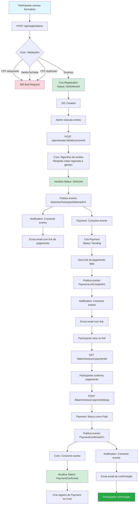

# 6. IMPLEMENTAÇÃO

A implementação do SAMGestor foi conduzida seguindo os princípios de Clean Architecture e Domain-Driven Design (DDD), organizando o sistema em três microserviços independentes mas coesos: Core, Payment e Notification. Esta abordagem arquitetural permitiu a separação clara de responsabilidades, facilitando a manutenção, testabilidade e evolução independente de cada componente do sistema.

O desenvolvimento priorizou a qualidade do código através da aplicação de padrões consolidados como CQRS (Command Query Responsibility Segregation) com MediatR, validações robustas com FluentValidation, e comunicação assíncrona baseada em eventos utilizando RabbitMQ. A infraestrutura foi containerizada com Docker, garantindo consistência entre ambientes de desenvolvimento, homologação e produção.

Um dos principais desafios superados foi a implementação de um sistema de sorteio justo e auditável, que respeita cotas regionais e de gênero, garantindo transações ACID através de isolamento serializável. Outro aspecto crítico foi o design do padrão Outbox para garantir entrega confiável de eventos entre microserviços, evitando inconsistências de dados mesmo em cenários de falha.

## 6.1 Stack Tecnológica e Infraestrutura

O SAMGestor foi construído utilizando tecnologias modernas e consolidadas do ecossistema .NET, priorizando performance, escalabilidade e produtividade no desenvolvimento. A escolha do .NET 8 como plataforma base proporciona suporte de longo prazo (LTS) e recursos avançados de linguagem através do C# 12.

### Principais Tecnologias

| Categoria | Nome | Versão | Finalidade/Uso no Projeto | Serviço(s) |
|-----------|------|--------|---------------------------|------------|
| **Linguagem e Runtime** |
| Runtime | .NET | 8.0 | Plataforma de execução e desenvolvimento | Todos |
| Linguagem | C# | 12 | Linguagem de programação principal | Todos |
| **Banco de Dados** |
| SGBD | PostgreSQL | 16 | Banco de dados relacional principal | Todos |
| Ferramenta Admin | pgAdmin | 8 | Interface web para administração do PostgreSQL | Infraestrutura |
| **Mensageria** |
| Message Broker | RabbitMQ | 3.13 | Comunicação assíncrona entre microserviços | Todos |
| **Containerização** |
| Container Runtime | Docker | - | Containerização de aplicações | Todos |
| Orquestração | Docker Compose | 3.9 | Orquestração de múltiplos containers | Infraestrutura |
| **ORM e Data Access** |
| ORM | Entity Framework Core | 8.0.8 / 9.0.8 | Mapeamento objeto-relacional e migrations | Todos |
| Provider | Npgsql.EntityFrameworkCore.PostgreSQL | 8.0.8 / 9.0.4 | Provider EF Core para PostgreSQL | Todos |
| **Bibliotecas de Aplicação** |
| Mediator | MediatR | 11.1.0 | Implementação de CQRS e padrão Mediator | Core |
| Validação | FluentValidation | 12.0.0 | Validação de comandos e queries | Core |
| Mensageria Client | RabbitMQ.Client | 7.1.2 | Cliente para comunicação com RabbitMQ | Todos |
| Geração PDF | QuestPDF | 2024.10.0 | Geração de relatórios em PDF | Core |
| **Ferramentas de Desenvolvimento** |
| Documentação API | Swagger/Swashbuckle | 6.6.2 / 9.0.4 | Documentação interativa de APIs REST | Todos |
| Email (Dev) | MailHog | latest | Servidor SMTP fake para desenvolvimento | Infraestrutura |
| **Testes** |
| Framework de Testes | xUnit | - | Framework de testes unitários e integração | Core |
| Mocking | Moq | - | Biblioteca para criação de mocks em testes | Core |
| Containers de Teste | Testcontainers | - | Containers Docker para testes de integração | Core |

### Observações sobre Versões

- **Entity Framework Core**: O serviço Core utiliza versão 8.0.8 (alinhada com .NET 8), enquanto Payment e Notification utilizam 9.0.8 (versão mais recente, compatível com .NET 8)
- **Npgsql**: Versões 8.0.8 e 9.0.4 são utilizadas de acordo com a versão do EF Core em cada serviço
- **Swagger**: Core utiliza Swashbuckle 6.6.2, enquanto Payment e Notification utilizam 9.0.4

## 6.2 Estrutura dos Microserviços

Todos os microserviços do SAMGestor seguem os princípios da Clean Architecture, organizando o código em camadas bem definidas que promovem separação de responsabilidades, testabilidade e independência de frameworks externos. A estrutura é consistente entre os serviços, facilitando a navegação e manutenção do código.

### Camadas da Clean Architecture

A arquitetura é organizada em quatro camadas principais, com dependências sempre apontando para dentro (das camadas externas para as internas):

1. **Domain (Domínio)**: Núcleo da aplicação, contém entidades, value objects, enums e interfaces de repositórios. Não possui dependências externas.

2. **Application (Aplicação)**: Contém a lógica de aplicação através de Commands, Queries, Handlers e Validators. Depende apenas da camada de Domain.

3. **Infrastructure (Infraestrutura)**: Implementa detalhes técnicos como acesso a dados, mensageria, email, etc. Depende de Domain e Application.

4. **API (Apresentação)**: Camada de entrada HTTP, contém controllers, middlewares e configurações. Depende de todas as outras camadas.

### Estrutura de Pastas do Serviço Core (SAMGestor)

```
src/
├── SAMGestor.Domain/                    # Camada de Domínio
│   ├── Entities/                        # Entidades de domínio (Aggregates)
│   │   ├── Registration.cs              # Aggregate Root: Inscrição de participante
│   │   ├── Retreat.cs                   # Aggregate Root: Retiro
│   │   ├── ServiceRegistration.cs       # Aggregate Root: Inscrição para servir
│   │   ├── Payment.cs                   # Entidade: Pagamento
│   │   ├── Family.cs                    # Aggregate Root: Família
│   │   ├── Tent.cs                      # Aggregate Root: Barraca
│   │   └── User.cs                      # Aggregate Root: Usuário
│   ├── ValueObjects/                    # Value Objects
│   │   ├── CPF.cs                       # CPF validado
│   │   ├── EmailAddress.cs              # Email validado
│   │   ├── FullName.cs                  # Nome completo
│   │   ├── Money.cs                     # Valor monetário
│   │   └── Percentage.cs                # Percentual
│   ├── Enums/                           # Enumerações
│   │   ├── RegistrationStatus.cs        # Status da inscrição
│   │   ├── Gender.cs                    # Gênero
│   │   └── PaymentStatus.cs             # Status do pagamento
│   ├── Exceptions/                      # Exceções de domínio
│   │   ├── BusinessRuleException.cs     # Violação de regra de negócio
│   │   └── NotFoundException.cs         # Entidade não encontrada
│   ├── Interfaces/                      # Interfaces de repositórios
│   │   ├── IRegistrationRepository.cs
│   │   ├── IRetreatRepository.cs
│   │   └── IUnitOfWork.cs
│   └── Common/                          # Classes base
│       ├── Entity.cs                    # Classe base para entidades
│       └── ValueObject.cs               # Classe base para value objects
│
├── SAMGestor.Application/               # Camada de Aplicação
│   ├── Features/                        # Organizados por feature (vertical slices)
│   │   ├── Registrations/
│   │   │   ├── Create/
│   │   │   │   ├── CreateRegistrationCommand.cs      # Command
│   │   │   │   ├── CreateRegistrationHandler.cs      # Handler
│   │   │   │   ├── CreateRegistrationValidator.cs    # Validador
│   │   │   │   └── CreateRegistrationResponse.cs     # DTO de resposta
│   │   │   ├── GetAll/
│   │   │   └── GetById/
│   │   ├── Retreats/
│   │   │   ├── Create/
│   │   │   ├── Update/
│   │   │   └── GetById/
│   │   ├── Lottery/                     # Sorteio de participantes
│   │   ├── Service/                     # Gestão de serviços
│   │   └── Auth/                        # Autenticação
│   ├── Behaviors/                       # Pipeline Behaviors do MediatR
│   │   └── ValidationBehavior.cs        # Validação automática
│   ├── Interfaces/                      # Interfaces de serviços
│   │   ├── IEventBus.cs                 # Publicação de eventos
│   │   └── IStorageService.cs           # Armazenamento de arquivos
│   └── Common/                          # DTOs e classes compartilhadas
│
├── SAMGestor.Infrastructure/            # Camada de Infraestrutura
│   ├── Persistence/                     # Acesso a dados
│   │   ├── SAMContext.cs                # DbContext principal
│   │   ├── Configurations/              # Configurações EF Core
│   │   └── Migrations/                  # Migrations do banco
│   ├── Repositories/                    # Implementações de repositórios
│   │   ├── RegistrationRepository.cs
│   │   ├── RetreatRepository.cs
│   │   └── UnitOfWork.cs
│   ├── Messaging/                       # Mensageria
│   │   ├── RabbitMqConnection.cs        # Conexão com RabbitMQ
│   │   ├── EventPublisher.cs            # Publicador de eventos
│   │   ├── Outbox/                      # Padrão Outbox
│   │   │   ├── OutboxMessage.cs         # Entidade de mensagem
│   │   │   ├── OutboxEventBus.cs        # Event Bus com Outbox
│   │   │   └── OutboxDispatcher.cs      # Dispatcher de mensagens
│   │   └── Consumers/                   # Consumidores de eventos
│   │       ├── PaymentConfirmedConsumer.cs
│   │       └── FamilyGroupCreatedConsumer.cs
│   ├── Services/                        # Serviços de infraestrutura
│   │   ├── EmailService.cs              # Envio de emails
│   │   ├── StorageService.cs            # Armazenamento de arquivos
│   │   └── JwtTokenService.cs           # Geração de tokens JWT
│   └── Extensions/                      # Extension methods
│       └── ServiceCollectionExtensions.cs
│
└── SAMGestor.API/                       # Camada de Apresentação
    ├── Controllers/                     # Controllers REST
    │   ├── Registration/
    │   │   └── RegistrationsController.cs
    │   ├── Retreat/
    │   │   └── RetreatsController.cs
    │   └── Users/
    │       └── AuthController.cs
    ├── Middlewares/                     # Middlewares customizados
    │   └── ExceptionHandlingMiddleware.cs
    ├── Extensions/                      # Configurações
    │   ├── SwaggerExtensions.cs
    │   └── AuthExtensions.cs
    ├── Program.cs                       # Ponto de entrada
    ├── appsettings.json                 # Configurações
    └── Dockerfile                       # Imagem Docker
```

### Estrutura dos Serviços Payment e Notification

Os serviços Payment e Notification seguem estrutura similar, porém simplificada:

```
services/payment/src/
├── SAMGestor.Payment.Domain/            # Entidades: Payment
├── SAMGestor.Payment.Application/       # Abstrações e interfaces
├── SAMGestor.Payment.Infrastructure/    # Persistência, Messaging, Outbox
└── SAMGestor.Payment.API/               # Controllers e configuração

services/notification/src/
├── SAMGestor.Notification.Domain/       # Entidades: NotificationMessage, SelectedRegistration
├── SAMGestor.Notification.Application/  # Abstrações e interfaces
├── SAMGestor.Notification.Infrastructure/ # Email, Templates, Messaging
└── SAMGestor.Notification.API/          # Endpoints e configuração
```

### Projeto Compartilhado (Shared)

```
shared/
├── contracts/
│   └── SAMGestor.Contracts/             # Contratos de eventos (DTOs compartilhados)
│       ├── EventEnvelope.cs             # Envelope genérico de eventos
│       ├── EventTypes.cs                # Constantes de tipos de eventos
│       ├── SelectionParticipantSelectedV1.cs
│       ├── PaymentConfirmedV1.cs
│       └── PaymentLinkCreatedV1.cs
└── building-blocks/
    └── SAMGestor.BuildingBlocks/        # Utilitários compartilhados
```

Esta organização promove alta coesão dentro de cada camada e baixo acoplamento entre elas, facilitando testes unitários, substituição de implementações e evolução independente de cada componente.

## 6.3 Camada de Domínio

A camada de domínio representa o coração do sistema, encapsulando as regras de negócio essenciais e o conhecimento do domínio de gestão de retiros espirituais. Esta camada é completamente independente de frameworks e tecnologias externas, garantindo que a lógica de negócio permaneça pura e testável.

### Entidades de Domínio e Value Objects

O SAMGestor utiliza diversos Value Objects para garantir validação e encapsulamento de conceitos do domínio:

- **CPF**: Valida e armazena CPF brasileiro (11 dígitos)
- **EmailAddress**: Valida formato de email
- **FullName**: Nome completo com validação de nome e sobrenome
- **Money**: Valor monetário com moeda (Amount + Currency)
- **Percentage**: Percentual validado (0-100)
- **UrlAddress**: URL validada (HTTP/HTTPS)

### Exemplo: Aggregate Root Registration

A entidade `Registration` é um dos principais Aggregates do sistema, representando a inscrição de um participante em um retiro. Ela encapsula todas as regras de negócio relacionadas ao ciclo de vida de uma inscrição.

A classe `Registration` implementa:
- **Propriedades com Value Objects**: Name, Cpf, Email para garantir validação
- **Dados do retiro**: RetreatId, Status (NotSelected, Selected, PaymentConfirmed, Confirmed, Canceled)
- **Dados adicionais**: PhotoUrl, TentId, TeamId, CompletedRetreat
- **Dados de saúde**: HasAllergies, HasMedicalRestriction com detalhes
- **Consentimentos**: TermsAccepted, TermsAcceptedAt, TermsVersion, MarketingOptIn

**Métodos principais**:
- `AcceptTerms()`: Registra aceitação de termos com versão para auditoria
- `SetMarketingOptIn()`: Define preferência de comunicações de marketing
- `SetStatus()`: Atualiza status da inscrição
- `MarkConfirmed()`: Marca como confirmada após pagamento
- `SetAllergies()` e `SetMedicalRestriction()`: Registram informações de saúde
- `IsEligibleForTent()`: Verifica elegibilidade para atribuição de barraca
- `GetAgeOn()`: Calcula idade em data específica

### Eventos de Domínio

Embora não explicitamente implementados na entidade acima, o sistema utiliza eventos de domínio através do padrão Outbox para comunicação entre microserviços:

- **SelectionParticipantSelectedV1**: Publicado quando um participante é selecionado no sorteio
- **PaymentConfirmedV1**: Publicado quando um pagamento é confirmado
- **PaymentLinkCreatedV1**: Publicado quando um link de pagamento é gerado

Estes eventos são armazenados na tabela `OutboxMessages` e processados de forma assíncrona pelo `OutboxDispatcher`, garantindo entrega confiável mesmo em caso de falhas temporárias.

## 6.4 Camada de Aplicação

A camada de aplicação orquestra o fluxo de dados entre a camada de apresentação (API) e a camada de domínio, implementando casos de uso através do padrão CQRS (Command Query Responsibility Segregation) com MediatR. Esta separação permite otimizar operações de leitura e escrita de forma independente.

### Implementação de CQRS com MediatR

O MediatR atua como mediador entre controllers e handlers, desacoplando a camada de apresentação da lógica de aplicação. Cada operação é representada por um Command (escrita) ou Query (leitura), processado por um Handler específico.

**Benefícios da abordagem:**
- **Separação de responsabilidades**: Cada handler tem uma única responsabilidade
- **Testabilidade**: Handlers podem ser testados isoladamente
- **Pipeline behaviors**: Validação, logging e outras cross-cutting concerns são aplicadas automaticamente
- **Desacoplamento**: Controllers não conhecem implementações, apenas contratos

### Exemplo Completo: CreateRegistrationCommand

Este exemplo demonstra um fluxo completo de criação de inscrição, incluindo Command, Handler e Validator.

#### 1. Command (Contrato de Entrada)

O `CreateRegistrationCommand` é um record que implementa `IRequest<CreateRegistrationResponse>` do MediatR. Contém:

**Dados do retiro**: RetreatId

**Dados pessoais** (Value Objects): Name, Cpf, Email, Phone, BirthDate, Gender, City

**Dados adicionais**: MaritalStatus, Pregnancy, ShirtSize, WeightKg, HeightCm, Profession, StreetAndNumber, Neighborhood, State

**Contatos alternativos**: Whatsapp, FacebookUsername, InstagramHandle, NeighborPhone, RelativePhone

**Dados de saúde**: AlcoholUse, Smoker, UsesDrugs, DrugUseFrequency, HasAllergies, AllergiesDetails, HasMedicalRestriction, MedicalRestrictionDetails, TakesMedication, MedicationsDetails, PhysicalLimitationDetails, RecentSurgeryOrProcedureDetails

**Consentimentos**: TermsAccepted, TermsVersion, MarketingOptIn

**Contexto**: ClientIp, UserAgent

A resposta `CreateRegistrationResponse` retorna o RegistrationId gerado e uma mensagem de sucesso.

#### 2. Handler (Lógica de Aplicação)

O `CreateRegistrationHandler` implementa `IRequestHandler<CreateRegistrationCommand, CreateRegistrationResponse>` e executa:

**1. Validação do Retiro**: Verifica existência e se a janela de inscrições está aberta

**2. Regras de Unicidade e Bloqueio**: Valida se CPF está bloqueado ou já inscrito neste retiro

**3. Criação da Entidade**: Instancia `Registration` com status inicial `NotSelected`

**4. Enriquecimento de Dados**: Popula dados pessoais, endereço, contatos alternativos e informações de saúde através de métodos específicos

**5. Consentimentos**: Valida aceitação de termos e registra opt-in de marketing

**6. Persistência**: Adiciona ao repositório e salva via Unit of Work (garante transação)

**7. Retorno**: Retorna RegistrationId gerado

O handler injeta `IRegistrationRepository`, `IRetreatRepository` e `IUnitOfWork` via constructor injection.

#### 3. Validator (Validação com FluentValidation)

O `CreateRegistrationValidator` estende `AbstractValidator<CreateRegistrationCommand>` e é executado automaticamente pelo `ValidationBehavior` antes do Handler.

**Validações implementadas**:

**Retiro**: RetreatId obrigatório

**Dados Pessoais**:
- Name: obrigatório, máximo 120 caracteres
- Cpf: obrigatório
- Email: obrigatório
- Phone: obrigatório, máximo 20 caracteres
- BirthDate: deve estar no passado
- City: obrigatório, máximo 80 caracteres

**Dados Físicos**:
- WeightKg: entre 0 e 300 kg
- HeightCm: entre 0 e 250 cm

**Consentimento**:
- TermsAccepted: deve ser true
- TermsVersion: obrigatório quando termos são aceitos

### Pipeline Behaviors Implementados

O sistema utiliza Pipeline Behaviors do MediatR para aplicar cross-cutting concerns de forma centralizada:

#### ValidationBehavior

O `ValidationBehavior<TRequest, TResponse>` implementa `IPipelineBehavior<TRequest, TResponse>` e executa validações FluentValidation automaticamente antes de cada Handler.

**Funcionamento**:
1. Verifica se há validadores registrados para o request
2. Cria contexto de validação
3. Executa todos os validadores em paralelo
4. Coleta todos os erros encontrados
5. Se há erros, lança `ValidationException` (capturada pelo `ExceptionHandlingMiddleware`)
6. Se sem erros, prossegue para o próximo behavior ou handler

**Registro no Program.cs**:
```
builder.Services.AddValidatorsFromAssemblyContaining<CreateRetreatValidator>();
builder.Services.AddTransient(typeof(IPipelineBehavior<,>), typeof(ValidationBehavior<,>));
```

Isso registra todos os validadores do assembly e o ValidationBehavior para todos os requests.

### Tratamento de Exceções

O `ExceptionHandlingMiddleware` captura exceções e retorna respostas HTTP apropriadas:

- **ValidationException**: 400 Bad Request com mensagens de erro
- **BusinessRuleException**: 400 Bad Request com mensagem da regra violada
- **NotFoundException**: 404 Not Found
- **UnauthorizedAccessException**: 401 Unauthorized
- **Outras exceções**: 500 Internal Server Error (sem expor detalhes internos)

## 6.5 Fluxos de Negócio Implementados

O SAMGestor implementa dois fluxos principais que demonstram a interação entre os três microserviços através de comunicação assíncrona baseada em eventos.

### Fluxo de Participação (Fazer o Retiro)

Este diagrama ilustra o processo completo desde a inscrição até a confirmação de participação:



**Descrição do Fluxo:**

1. **Inscrição Inicial**: Participante preenche formulário e envia para `POST /api/registrations`
2. **Validações**: Core valida CPF, janela de inscrições, duplicidade
3. **Criação**: Registration criada com status `NotSelected`
4. **Sorteio**: Admin executa sorteio que respeita cotas regionais (50% Oeste, 50% outras) e de gênero
5. **Seleção**: Participantes selecionados têm status atualizado para `Selected`
6. **Evento de Seleção**: Core publica `SelectionParticipantSelectedV1`
7. **Notificação Inicial**: Notification envia email informando seleção
8. **Criação de Pagamento**: Payment cria registro e gera link fake
9. **Evento de Link**: Payment publica `PaymentLinkCreatedV1`
10. **Email com Link**: Notification envia email com link de pagamento
11. **Pagamento**: Participante acessa link e confirma pagamento
12. **Confirmação**: Payment marca como pago e publica `PaymentConfirmedV1`
13. **Atualização Core**: Core atualiza status para `PaymentConfirmed`
14. **Email Final**: Notification envia confirmação de participação

### Fluxo de Pagamento (Detalhado)

Este diagrama foca especificamente no processo de pagamento:

```mermaid
graph TD
    A[Participante selecionado] --> B[Core publica:<br/>SelectionParticipantSelectedV1]

    B --> C[Payment: PaymentRequestedConsumer]
    C --> D[Cria Payment<br/>RegistrationId, RetreatId, Amount]
    D --> E[Status: Pending]
    E --> F[Gera link fake:<br/>http://localhost:5002/fake/checkout/:id]
    F --> G[Atualiza Payment<br/>Status: LinkCreated<br/>LinkUrl, ExpiresAt]
    G --> H[Salva na Outbox:<br/>PaymentLinkCreatedV1]

    H --> I[OutboxDispatcher<br/>processa batch]
    I --> J[Publica no RabbitMQ<br/>Exchange: sam.topic<br/>RoutingKey: payment.link.created.v1]

    J --> K[Notification: PaymentLinkCreatedConsumer]
    K --> L[Renderiza template de email]
    L --> M[Envia via SMTP<br/>MailHog em dev]
    M --> N[Registra NotificationDispatchLog]

    N --> O[Participante recebe email]
    O --> P[Clica no link]
    P --> Q[GET /fake/checkout/:paymentId]
    Q --> R[Exibe formulário HTML<br/>com botão Pagar]

    R --> S[Participante clica Pagar]
    S --> T[POST /fake/checkout/:paymentId/pay]
    T --> U[Payment.MarkPaid<br/>Status: Paid<br/>PaidAt: now]
    U --> V[Salva na Outbox:<br/>PaymentConfirmedV1]

    V --> W[OutboxDispatcher<br/>processa batch]
    W --> X[Publica no RabbitMQ<br/>RoutingKey: payment.confirmed.v1]

    X --> Y[Core: PaymentConfirmedConsumer]
    Y --> Z[Busca Registration]
    Z --> AA[Registration.MarkConfirmed<br/>Status: PaymentConfirmed]
    AA --> AB[Cria Payment no Core<br/>para histórico]

    X --> AC[Notification: PaymentConfirmedConsumer]
    AC --> AD[Renderiza template de confirmação]
    AD --> AE[Envia email de confirmação]

    AE --> AF[Fluxo completo!]

    style A fill:#e1f5ff
    style G fill:#fff3cd
    style U fill:#d4edda
    style AA fill:#d4edda
    style AF fill:#28a745,color:#fff
```



### Interação entre os 3 Serviços

Os três microserviços interagem através de um padrão de comunicação assíncrona baseado em eventos, garantindo baixo acoplamento e alta resiliência:

#### 1. Core (Orquestrador Principal)

**Responsabilidades:**
- Gerencia entidades principais: Retreats, Registrations, Families, Tents
- Executa lógica de negócio complexa (sorteio, atribuição de barracas)
- Publica eventos de domínio quando mudanças importantes ocorrem
- Consome eventos de Payment para atualizar status de inscrições

**Eventos Publicados:**
- `SelectionParticipantSelectedV1`: Quando participante é selecionado no sorteio
- `ServingParticipantSelectedV1`: Quando voluntário é selecionado para servir
- `FamilyGroupCreateRequestedV1`: Quando criação de família é solicitada

**Eventos Consumidos:**
- `PaymentConfirmedV1`: Atualiza status da inscrição para PaymentConfirmed
- `FamilyGroupCreatedV1`: Confirma criação bem-sucedida de família
- `FamilyGroupCreateFailedV1`: Trata falha na criação de família

#### 2. Payment (Gestão de Pagamentos)

**Responsabilidades:**
- Cria registros de pagamento quando participantes são selecionados
- Gera links de pagamento (fake em dev, MercadoPago em produção)
- Processa confirmações de pagamento
- Mantém histórico de transações

**Eventos Publicados:**
- `PaymentLinkCreatedV1`: Quando link de pagamento é gerado
- `PaymentConfirmedV1`: Quando pagamento é confirmado

**Eventos Consumidos:**
- `SelectionParticipantSelectedV1`: Cria Payment e gera link

#### 3. Notification (Comunicação com Participantes)

**Responsabilidades:**
- Envia emails transacionais (seleção, pagamento, confirmação)
- Renderiza templates de email com dados dinâmicos
- Mantém log de notificações enviadas
- Futuramente: envio de WhatsApp

**Eventos Publicados:**
- Nenhum (serviço terminal)

**Eventos Consumidos:**
- `SelectionParticipantSelectedV1`: Envia email de seleção
- `PaymentLinkCreatedV1`: Envia email com link de pagamento
- `PaymentConfirmedV1`: Envia email de confirmação
- `ServingParticipantSelectedV1`: Envia email para voluntários

### Padrão Outbox para Garantia de Entrega

Todos os eventos são persistidos em uma tabela `OutboxMessages` antes de serem publicados no RabbitMQ. O `OutboxDispatcher` processa mensagens pendentes em batches:

**Vantagens:**
- **Atomicidade**: Evento é salvo na mesma transação que a mudança de estado
- **Garantia de entrega**: Mensagens não são perdidas mesmo se RabbitMQ estiver indisponível
- **Retry automático**: Mensagens com falha são reprocessadas
- **Idempotência**: Consumidores devem ser idempotentes para lidar com duplicatas

**Configuração (appsettings.json):**
**Configuração do Outbox**:
- BatchSize: 50 mensagens por lote
- PollIntervalSeconds: 10 segundos entre verificações
- UseListenNotify: false (polling em vez de notificações)
- WatchdogSeconds: 30 segundos para timeout

## 6.6 APIs RESTful

O SAMGestor expõe APIs RESTful seguindo convenções HTTP e princípios REST, com documentação interativa via Swagger/OpenAPI. Cada microserviço possui sua própria API independente.

### Padrão de Endpoints

Os endpoints seguem convenções RESTful consistentes:

- **Recursos no plural**: `/api/registrations`, `/api/retreats`
- **IDs na URL**: `/api/registrations/{id}`
- **Recursos aninhados**: `/api/retreats/{retreatId}/service/registrations`
- **Ações especiais**: `/api/retreats/{id}/lottery/commit`
- **Versionamento**: Preparado para `/api/v1/...` quando necessário

### Implementação de Autenticação JWT

O sistema utiliza JSON Web Tokens (JWT) para autenticação e autorização, com suporte a políticas de acesso baseadas em roles.

#### Configuração JWT (appsettings.json)

**Propriedades**:
- Issuer: SAMGestor
- Audience: SAMGestor.WebApp
- SecretKey: Chave secreta com pelo menos 32 caracteres
- ExpirationMinutes: 60 minutos

#### Fluxo de Autenticação

1. **Login**: `POST /api/login` com email e senha
2. **Validação**: Sistema valida credenciais e gera JWT
3. **Token**: Cliente recebe token e armazena (localStorage/sessionStorage)
4. **Requisições**: Cliente envia token no header `Authorization: Bearer {token}`
5. **Validação**: Middleware valida token e extrai claims (userId, role, email)
6. **Autorização**: Policies verificam se usuário tem permissão para a ação

#### Políticas de Autorização Implementadas

- **ReadOnly**: Permite apenas leitura (GET)
- **ManageAllButDeleteUsers**: Permite criar/editar, mas não deletar usuários
- **AdminOnly**: Acesso total (apenas administradores)
- **EmailConfirmed**: Requer email confirmado

**Uso em Controller**: Controllers utilizam `[Authorize(Policy = Policies.AdminOnly)]` para proteger endpoints específicos.

### Principais Endpoints por Serviço

#### Core API (Porta 5000)

| Método | Rota | Descrição | Autenticação |
|--------|------|-----------|--------------|
| **Autenticação** |
| POST | `/api/login` | Autentica usuário e retorna JWT | Não |
| GET | `/api/refresh` | Renova token JWT | Não |
| POST | `/api/auth/confirm-email` | Confirma email com token | Não |
| **Retiros** |
| POST | `/api/retreats` | Cria novo retiro | Sim (Admin) |
| GET | `/api/retreats` | Lista retiros (paginado) | Não |
| GET | `/api/retreats/{id}` | Busca retiro por ID | Não |
| PUT | `/api/retreats/{id}` | Atualiza retiro | Sim (Admin) |
| DELETE | `/api/retreats/{id}` | Remove retiro | Sim (Admin) |
| **Inscrições (Participantes)** |
| POST | `/api/registrations` | Cria inscrição de participante | Não |
| GET | `/api/registrations` | Lista inscrições com filtros | Sim |
| GET | `/api/registrations/{id}` | Busca inscrição por ID | Sim |
| POST | `/api/registrations/{id}/photo` | Upload de foto 3x4 | Não |
| GET | `/api/registrations/options` | Retorna enums para formulário | Não |
| **Sorteio** |
| GET | `/api/retreats/{id}/lottery/preview` | Simula sorteio (não persiste) | Sim (Admin) |
| POST | `/api/retreats/{id}/lottery/commit` | Executa e persiste sorteio | Sim (Admin) |
| POST | `/api/retreats/{id}/lottery/select/{regId}` | Seleciona participante manualmente | Sim (Admin) |
| POST | `/api/retreats/{id}/lottery/unselect/{regId}` | Remove seleção manual | Sim (Admin) |
| **Inscrições (Servir)** |
| POST | `/api/retreats/{retreatId}/service/registrations` | Inscrição para servir | Não |
| GET | `/api/retreats/{retreatId}/service/registrations` | Lista inscrições de serviço | Sim |
| GET | `/api/retreats/{retreatId}/service/registrations/{id}` | Busca inscrição de serviço | Sim |
| **Barracas** |
| POST | `/api/retreats/{retreatId}/tents` | Cria barraca | Sim (Admin) |
| POST | `/api/retreats/{retreatId}/tents/bulk` | Cria múltiplas barracas | Sim (Admin) |
| GET | `/api/retreats/{retreatId}/tents` | Lista barracas | Sim |
| PUT | `/api/retreats/{retreatId}/tents/{id}` | Atualiza barraca | Sim (Admin) |
| POST | `/api/retreats/{retreatId}/tents/auto-assign` | Atribui barracas automaticamente | Sim (Admin) |
| **Famílias** |
| POST | `/api/retreats/{retreatId}/families` | Cria família | Sim (Admin) |
| GET | `/api/retreats/{retreatId}/families` | Lista famílias | Sim |
| POST | `/api/retreats/{retreatId}/families/generate` | Gera famílias automaticamente | Sim (Admin) |
| **Dashboards** |
| GET | `/api/retreats/{retreatId}/dashboard/overview` | Visão geral do retiro | Sim |
| GET | `/api/retreats/{retreatId}/dashboard/families` | Estatísticas de famílias | Sim |
| GET | `/api/retreats/{retreatId}/dashboard/payments` | Estatísticas de pagamentos | Sim |
| **Usuários** |
| POST | `/api/users` | Cria usuário administrativo | Sim (Admin) |
| GET | `/api/users/{id}` | Busca usuário por ID | Sim |
| PUT | `/api/users/{id}` | Atualiza usuário | Sim |

#### Payment API (Porta 5002)

| Método | Rota | Descrição | Autenticação |
|--------|------|-----------|--------------|
| GET | `/health` | Health check do serviço | Não |
| GET | `/fake/checkout/{paymentId}` | Tela de checkout fake (HTML) | Não |
| POST | `/fake/checkout/{paymentId}/pay` | Confirma pagamento fake | Não |
| GET | `/fake/confirm/{paymentId}` | Atalho para confirmar pagamento | Não |

**Observação**: Em produção, os endpoints `/fake/*` serão substituídos por integração real com MercadoPago.

#### Notification API (Porta 5001)

| Método | Rota | Descrição | Autenticação |
|--------|------|-----------|--------------|
| GET | `/health` | Health check do serviço | Não |
| POST | `/admin/dev/selection` | Simula evento de seleção (dev) | Não |

**Observação**: Este serviço é principalmente orientado a eventos, com poucos endpoints HTTP públicos.

### Documentação Swagger

Todos os serviços expõem documentação interativa via Swagger UI:

- **Core API**: http://localhost:5000/swagger
- **Payment API**: http://localhost:5002/swagger
- **Notification API**: http://localhost:5001/swagger

A documentação inclui:
- Descrição de cada endpoint
- Parâmetros esperados (path, query, body)
- Schemas de request/response
- Códigos de status HTTP
- Possibilidade de testar endpoints diretamente

**Configuração Swagger (Program.cs):**

**Configuração Swagger**: No Program.cs, registra serviços de exploração de endpoints e geração de Swagger. Em desenvolvimento, ativa middleware para servir Swagger UI.

## 6.7 Integração com Serviços Externos

O SAMGestor foi projetado com abstrações que facilitam a substituição de implementações de serviços externos, permitindo uso de mocks em desenvolvimento e serviços reais em produção.

### Email: MailHog (Desenvolvimento) → SendGrid/SES (Produção)

#### Implementação Atual (Desenvolvimento)

**MailHog** é um servidor SMTP fake que captura emails sem enviá-los, ideal para desenvolvimento e testes.

**Configuração (appsettings.json)**:
- Host: mailhog
- Port: 1025
- EnableSsl: false
- FromAddress: no-reply@samgestor.local
- FromName: SAMGestor

**Interface Web**: http://localhost:8025 (visualiza emails capturados)

**Implementação**: A classe `EmailChannel` implementa `INotificationChannel` e utiliza `SmtpClient` para enviar emails através do MailHog.

#### Migração Futura para Produção

**Opção 1: SendGrid**
- Serviço de email transacional da Twilio
- API REST simples
- Templates gerenciados na plataforma
- Estatísticas de entrega, abertura, cliques

**Opção 2: Amazon SES**
- Serviço de email da AWS
- Custo muito baixo
- Integração com SNS para notificações de bounce/complaint
- Requer configuração de domínio (SPF, DKIM)

**Abstração permite troca transparente**: Registro condicional baseado em ambiente permite usar `EmailChannel` em desenvolvimento e `SendGridChannel` em produção.

### WhatsApp: Simulado → Z-API/Twilio (Produção)

#### Implementação Atual (Desenvolvimento)

Atualmente, notificações via WhatsApp são apenas simuladas através de logs. A classe `WhatsAppChannelMock` implementa `INotificationChannel` e registra as mensagens no logger.

#### Migração Futura para Produção

**Opção 1: Z-API**
- API brasileira para WhatsApp Business
- Suporta mensagens de texto, imagens, documentos
- Templates aprovados pelo WhatsApp
- Webhooks para status de entrega

**Opção 2: Twilio WhatsApp API**
- Integração oficial com WhatsApp
- Requer aprovação de templates
- Suporte global
- Integração com outros canais (SMS, Voice)

**Implementação futura**: A classe `ZApiWhatsAppChannel` implementaria `INotificationChannel` e faria requisições HTTP POST para a Z-API com os dados do telefone e mensagem.

### Pagamento: Fake Gateway → MercadoPago (Produção)

#### Implementação Atual (Desenvolvimento)

O sistema utiliza um gateway de pagamento fake que simula o fluxo completo:

**FakePaymentsController.cs:**
- `GET /fake/checkout/{paymentId}`: Exibe formulário HTML simples
- `POST /fake/checkout/{paymentId}/pay`: Confirma pagamento instantaneamente
- `GET /fake/confirm/{paymentId}`: Atalho para confirmação direta

**Vantagens do Fake Gateway:**
- Testes rápidos sem necessidade de credenciais reais
- Controle total sobre cenários (sucesso, falha, timeout)
- Sem custos de transação
- Desenvolvimento offline

#### Migração Futura para MercadoPago

**MercadoPago** é a solução de pagamentos do Mercado Livre, amplamente utilizada no Brasil.

**Fluxo de Integração**:

1. **Criação de Preferência de Pagamento**: A classe `MercadoPagoPaymentService` implementa `IPaymentService` e cria preferências de pagamento via API REST do MercadoPago, incluindo items, URLs de callback e referência externa.

2. **Webhook para Confirmação**: Um endpoint POST em `/webhooks/mercadopago` valida a assinatura do webhook, busca detalhes do pagamento, marca como pago e publica evento `PaymentConfirmedV1`.

**Configuração (appsettings.json)**:
- AccessToken: Token de acesso da API
- PublicKey: Chave pública
- CallbackBaseUrl: URL base para callbacks
- WebhookSecret: Secret para validação de webhooks

### Abstração de Serviços Externos

Todas as integrações são abstraídas através de interfaces, permitindo substituição via Dependency Injection.

**Interface `IPaymentService`**: Define métodos `CreatePaymentLinkAsync()` e `GetPaymentDetailsAsync()`

**Registro condicional**: Em desenvolvimento usa `FakePaymentService`, em produção usa `MercadoPagoPaymentService`

Esta abordagem garante:
- **Testabilidade**: Mocks facilitam testes unitários
- **Flexibilidade**: Troca de providers sem alterar lógica de negócio
- **Desenvolvimento ágil**: Trabalho offline sem dependências externas
- **Migração gradual**: Substituição incremental de serviços

## 6.8 Infraestrutura e Deploy

A infraestrutura do SAMGestor foi containerizada com Docker, permitindo implantação consistente em qualquer ambiente que suporte containers. O Docker Compose orquestra todos os serviços necessários, incluindo banco de dados, message broker e os três microserviços.

### Arquitetura de Containers

O sistema é composto por 7 containers principais:

```
┌─────────────────────────────────────────────────────────────┐
│                     Docker Network: samgestor                │
├─────────────────────────────────────────────────────────────┤
│                                                               │
│  ┌──────────┐  ┌──────────┐  ┌──────────┐  ┌──────────┐    │
│  │  Core    │  │ Payment  │  │Notifica- │  │ RabbitMQ │    │
│  │   API    │  │   API    │  │ tion API │  │          │    │
│  │  :5000   │  │  :5002   │  │  :5001   │  │ :5672    │    │
│  │          │  │          │  │          │  │ :15672   │    │
│  └────┬─────┘  └────┬─────┘  └────┬─────┘  └────┬─────┘    │
│       │             │             │             │           │
│       └─────────────┴─────────────┴─────────────┘           │
│                     │             │                         │
│              ┌──────┴─────┐  ┌───┴──────┐                  │
│              │ PostgreSQL │  │ MailHog  │                  │
│              │   :5432    │  │ :1025    │                  │
│              │            │  │ :8025    │                  │
│              └──────┬─────┘  └──────────┘                  │
│                     │                                       │
│              ┌──────┴─────┐                                │
│              │  pgAdmin   │                                │
│              │   :5050    │                                │
│              └────────────┘                                │
│                                                             │
└─────────────────────────────────────────────────────────────┘
```

### Docker Compose Completo

O arquivo `docker-compose.yml` define toda a infraestrutura com os seguintes serviços:

**Banco de Dados**: PostgreSQL 16 Alpine com healthcheck, volumes persistentes e script de inicialização

**Administração**: pgAdmin 8 para gerenciamento do PostgreSQL

**Message Broker**: RabbitMQ 3.13 com Management UI e healthcheck

**Email (Dev)**: MailHog para captura de emails em desenvolvimento

**Microserviços**:
- **Core API** (porta 5000): Build do Dockerfile, variáveis de ambiente para DB, RabbitMQ, JWT
- **Notification API** (porta 5001): Build do Dockerfile, configuração SMTP para MailHog
- **Payment API** (porta 5002): Build do Dockerfile, configuração de fake payment

**Volumes Persistentes**: postgres_data, pgadmin_data, rabbitmq_data

**Rede**: Bridge network "samgestor" para comunicação entre containers

Cada serviço possui:
- Restart policy: unless-stopped
- Variáveis de ambiente específicas
- Dependências com healthchecks
- Mapeamento de portas
- Volumes quando necessário

### Schemas Separados no PostgreSQL

Cada microserviço utiliza um schema dedicado no mesmo banco de dados PostgreSQL, garantindo isolamento lógico:

**Script de Inicialização (init-db.sql)**:

O script cria três schemas (core, payment, notification) e configura:
- Schema padrão para o usuário samgestor com search_path
- Permissões em schemas
- Permissões em todas as tabelas presentes e futuras
- Privilégios padrão para novas tabelas

**Vantagens desta abordagem:**
- **Isolamento lógico**: Cada serviço tem seu próprio namespace
- **Simplicidade operacional**: Um único banco para gerenciar
- **Transações cross-schema**: Possíveis quando necessário (com cuidado)
- **Custo reduzido**: Não requer múltiplas instâncias de banco

**Desvantagens (trade-offs aceitos):**
- **Acoplamento de infraestrutura**: Todos os serviços compartilham a mesma instância
- **Escalabilidade limitada**: Não é possível escalar bancos independentemente
- **Risco de contenção**: Lock contention pode afetar múltiplos serviços

**Nota**: Em produção de alta escala, considerar migração para bancos separados.

### Dockerfiles Multi-Stage

Cada microserviço utiliza Dockerfile multi-stage para otimizar tamanho da imagem:

**Estrutura do Dockerfile**:

**Stage 1 - BUILD**:
- Usa SDK .NET 8.0
- Copia arquivos de projeto (.csproj)
- Restaura dependências
- Copia código-fonte
- Compila em Release

**Stage 2 - PUBLISH**:
- Publica a aplicação compilada

**Stage 3 - RUNTIME**:
- Usa apenas runtime .NET 8.0 (sem SDK)
- Cria usuário não-root para segurança
- Copia binários publicados
- Expõe porta 5000
- Define ponto de entrada

**Benefícios do Multi-Stage**:
- **Imagem final pequena**: Apenas runtime + binários (sem SDK)
- **Segurança**: Usuário não-root
- **Cache de layers**: Restauração de pacotes é cacheada
- **Build reproduzível**: Ambiente consistente

### Comandos de Deploy

#### Desenvolvimento Local

Comandos principais para gerenciar containers:

- `docker-compose up -d`: Inicia todos os serviços em background
- `docker-compose logs -f`: Visualiza logs em tempo real
- `docker-compose logs -f coreapi`: Logs de um serviço específico
- `docker-compose down`: Para todos os serviços
- `docker-compose down -v`: Para e remove volumes (limpa banco de dados)
- `docker-compose up -d --build`: Rebuild de imagens
- `docker-compose exec coreapi dotnet ef database update`: Executa migrations manualmente

#### Acesso aos Serviços

Após `docker-compose up -d`, os serviços estarão disponíveis em:

| Serviço | URL | Credenciais |
|---------|-----|-------------|
| Core API | http://localhost:5000 | - |
| Core Swagger | http://localhost:5000/swagger | - |
| Payment API | http://localhost:5002 | - |
| Payment Swagger | http://localhost:5002/swagger | - |
| Notification API | http://localhost:5001 | - |
| Notification Swagger | http://localhost:5001/swagger | - |
| RabbitMQ Management | http://localhost:15672 | samgestor / samgestor123 |
| MailHog Web UI | http://localhost:8025 | - |
| pgAdmin | http://localhost:5050 | admin@samgestor.local / admin |
| PostgreSQL | localhost:5432 | samgestor / samgestor123 |

### Migrations e Inicialização do Banco

As migrations do Entity Framework Core são executadas automaticamente na inicialização de cada serviço em desenvolvimento.

**Aplicação automática**: No Program.cs, em desenvolvimento, o código obtém o DbContext e executa `MigrateAsync()` automaticamente.

**Criação de nova migration**:

Para Core:
```
dotnet ef migrations add NomeDaMigration --project src/SAMGestor.Infrastructure --startup-project src/SAMGestor.API
```

Para Payment:
```
dotnet ef migrations add NomeDaMigration --project services/payment/src/SAMGestor.Payment.Infrastructure --startup-project services/payment/src/SAMGestor.Payment.API
```

Para Notification:
```
dotnet ef migrations add NomeDaMigration --project services/notification/src/SAMGestor.Notification.Infrastructure --startup-project services/notification/src/SAMGestor.Notification.API
```

### Monitoramento e Observabilidade

#### Health Checks

Todos os serviços expõem endpoints de health check em `/health`.

**Configuração**: Registra health checks para PostgreSQL e RabbitMQ.

**Uso**:
```
curl http://localhost:5000/health
```

Resposta: Healthy

#### Logs Estruturados

O sistema utiliza logging estruturado com Serilog (configuração futura).

**Configuração esperada**:
- MinimumLevel padrão: Information
- Overrides: Microsoft e System em Warning
- WriteTo: Console e File (com rolling diário)
- Arquivo de log: logs/samgestor-.log

### Estratégia de Deploy em Produção

Para deploy em produção, recomenda-se:

1. **Orquestração**: Kubernetes ou Docker Swarm para alta disponibilidade
2. **Banco de Dados**: PostgreSQL gerenciado (AWS RDS, Azure Database, etc.)
3. **Message Broker**: RabbitMQ gerenciado (CloudAMQP) ou Amazon MQ
4. **Secrets**: Variáveis de ambiente via Kubernetes Secrets ou AWS Secrets Manager
5. **Load Balancer**: NGINX ou cloud load balancer (ALB, Azure Load Balancer)
6. **SSL/TLS**: Certificados Let's Encrypt via cert-manager (Kubernetes)
7. **Monitoramento**: Prometheus + Grafana para métricas, ELK Stack para logs
8. **CI/CD**: GitHub Actions ou Azure DevOps para build e deploy automatizado

**Pipeline CI/CD (GitHub Actions)**:

O pipeline é acionado em push para a branch main e executa:

1. **Checkout**: Obtém o código do repositório
2. **Build Docker images**: Constrói imagens para Core, Payment e Notification
3. **Push to registry**: Faz login no Docker Registry e envia as imagens
4. **Deploy to Kubernetes**: Atualiza deployments no Kubernetes com as novas imagens

Usa secrets para credenciais do Docker Registry e configuração do Kubernetes.

---

## Conclusão da Seção de Implementação

A implementação do SAMGestor demonstra a aplicação prática de padrões arquiteturais modernos e boas práticas de engenharia de software. A separação em microserviços, aliada ao uso de Clean Architecture e DDD, resultou em um sistema modular, testável e preparado para evolução.

Os principais destaques técnicos incluem:

- **Arquitetura limpa e desacoplada**: Facilita manutenção e testes
- **Comunicação assíncrona confiável**: Padrão Outbox garante consistência eventual
- **Abstrações bem definidas**: Permite substituição de implementações sem impacto
- **Infraestrutura como código**: Docker Compose facilita deploy e replicação de ambientes
- **Validações robustas**: FluentValidation + Pipeline Behaviors garantem qualidade dos dados
- **Preparação para produção**: Abstrações permitem migração gradual de serviços fake para reais

O sistema está pronto para receber novas funcionalidades e evoluir conforme as necessidades da organização, mantendo a qualidade e consistência do código.


